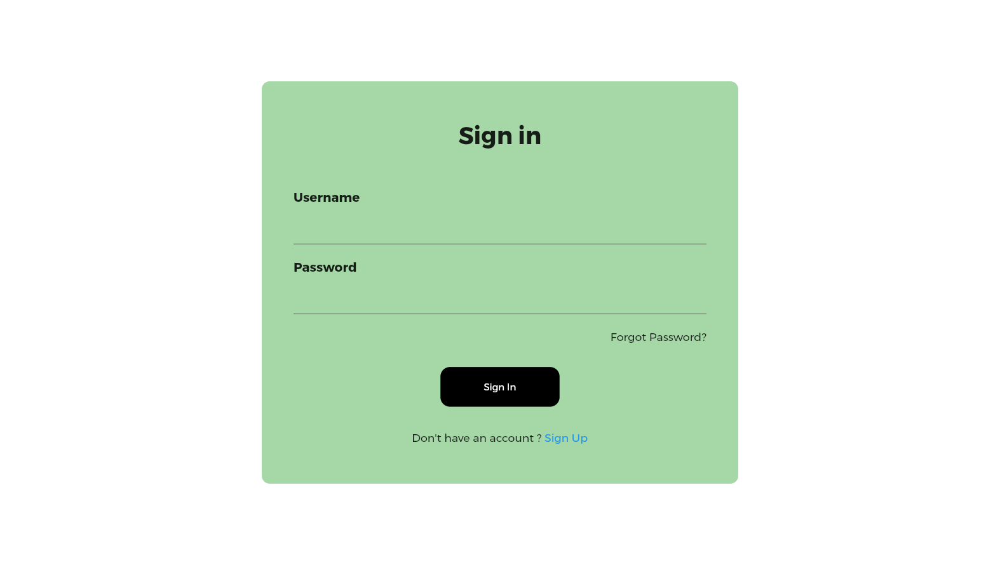
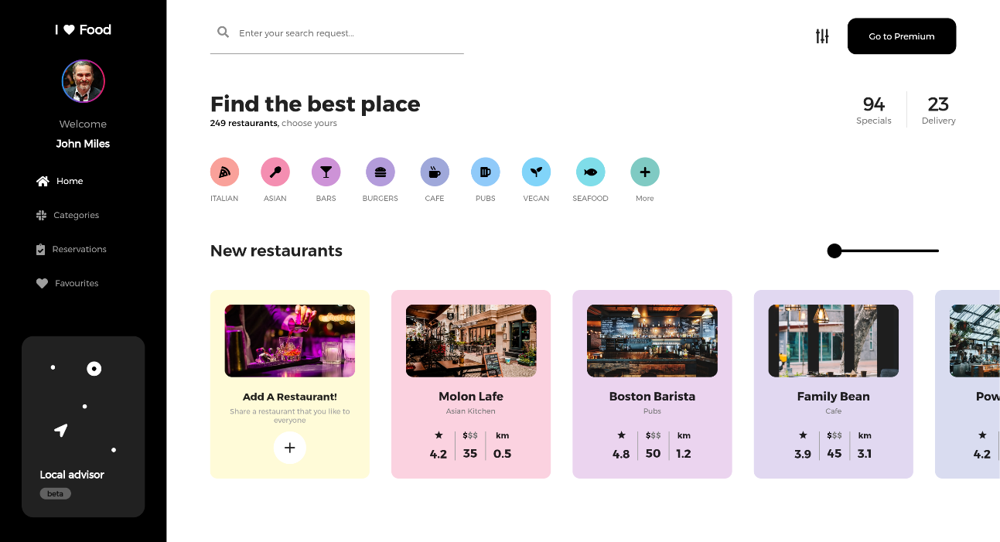
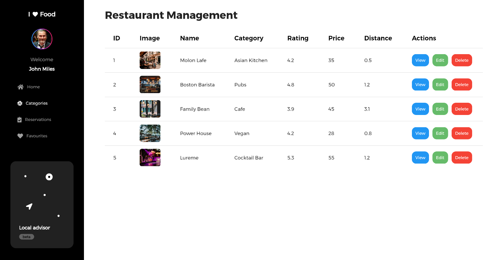
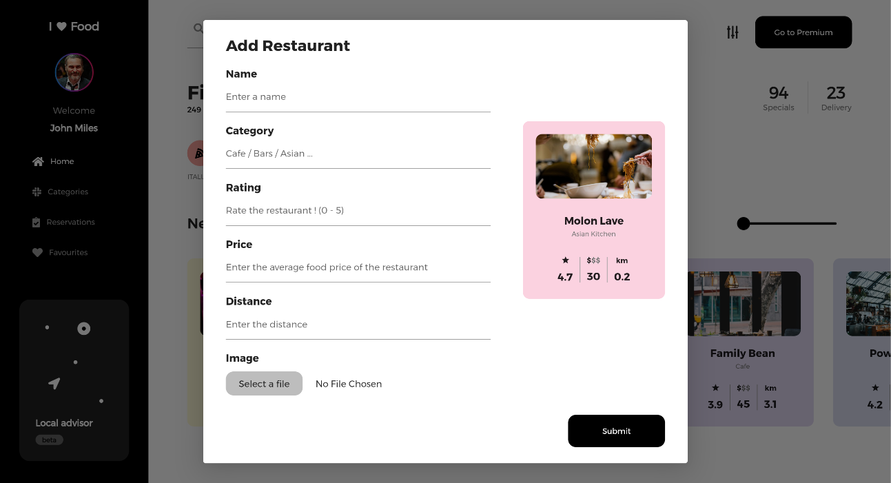
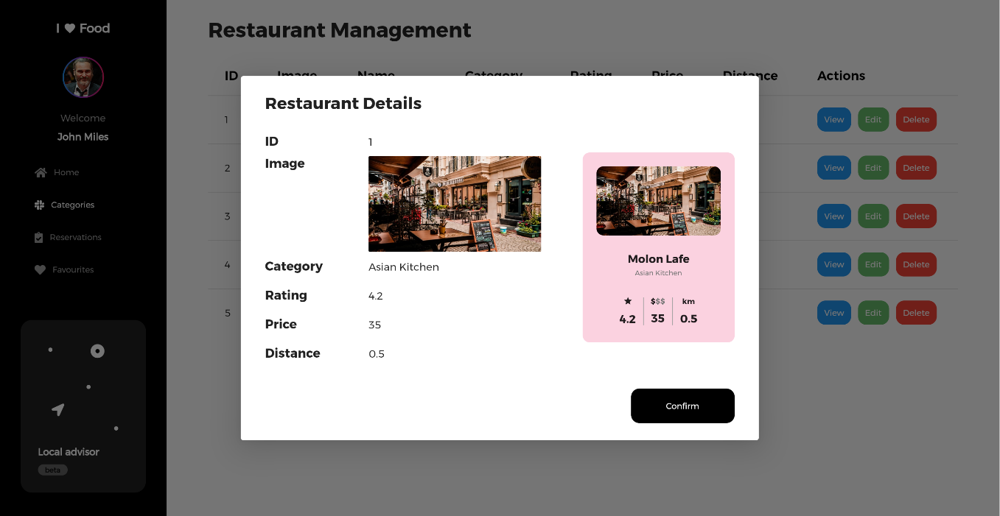
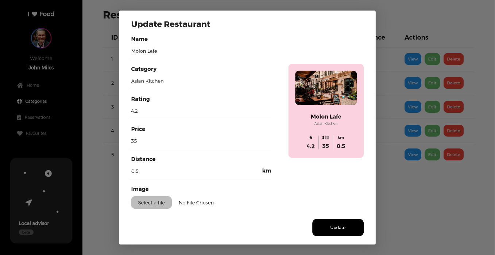
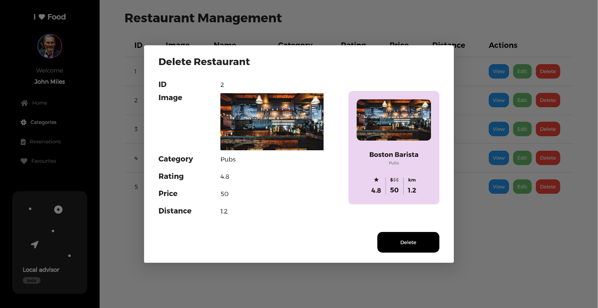

# Food Menu - Frontend

**Status: Still in progress**

This project is designed to display a list of restaurants, allowing users to view, filter, and
search for restaurants. Additionally, admins can add, edit, and delete restaurant entries. The
frontend module is built using Flutter.

## Features (Planned & In Progress)

- Display a list of restaurants for users.
- Search and filter restaurants.
- Admin functionality to add, edit, and delete restaurants.
- Responsive design for mobile and desktop web devices.
- User authentication (sign in/sign up).
- Restaurant image management.
- More features coming soon!

## Prerequisites

- Flutter SDK installed.
- Dart installed.
- A working backend API for restaurant data.

## Backend Repository

The backend for this project can be found here:
[restaurant_management_backend (GitHub)](https://github.com/amankrmj01/restaurant_management_backend)

## Installation

1. Clone the repository:
    ```bash
    git clone https://github.com/amankrmj01/food_menu_frontend
    cd food_dash/frontend/food_menu
    ```

2. Install dependencies:
    ```bash
    flutter pub get
    ```

3. Run the app:
    ```bash
    flutter run
    ```

## Folder Structure

```
food_menu/
├── lib/
│   ├── screens/
│   ├── widgets/
│   ├── models/
│   ├── services/
│   └── main.dart
├── assets/
│   ├── images/
│   └── icons/
└── pubspec.yaml
```

## Screenshots

<p align="center">







</p>

<!-- ## Contributing

Contributions are welcome! Please follow the [contribution guidelines](../CONTRIBUTING.md). --> 

### Backend repo

You can find the backend repository [here](https://github.com/amankrmj01/food_menu_backend).

## License

This project is licensed under the [MIT License](../LICENSE).

